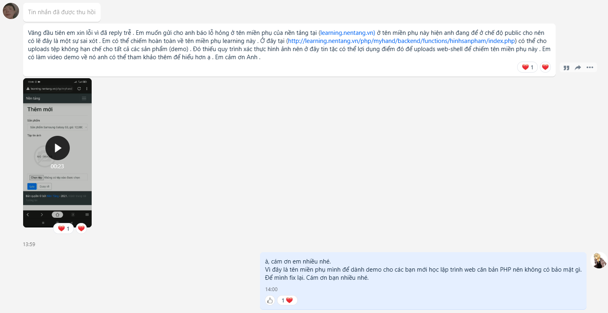

# [https://learning.nentang.vn](learning.nentang.vn)
- Các bài học miễn phí về Lập trình
- Học web PHP - Learning PHP
- Xem nhiều hơn tại [https://nentang.vn](https://nentang.vn)

# Học là phải THỰC HÀNH ❤🧡💛💚💙💜

# Danh sách các bài học
- Học về Twig - Template Engine quản lý giao diện của Symfony PHP.
  - [Vi du 1](./php/twig/readme.md)
  - [Bài học 1](./php/twig/readme-lession1.md)
  - [Bài học 2](./php/twig/readme-lession2.md)
  - [Bài học 3](./php/twig/readme-lession3.md)
  - [Bài học 4](./php/twig/readme-lession4.md)
  - [Bài học 5](./php/twig/readme-lession5.md)
  - [Bài học 6](./php/twig/readme-lession6.md)
  - [Bài học 7](./php/twig/readme-lession7.md)
  - [Bài học 8](./php/twig/readme-lession8.md)
  - [Bài học 9](./php/twig/readme-lession9.md)
  - [Bài học 10](./php/twig/readme-lession10.md)

# Các chương trình cần thiết để lập trình web
- [Git for window](https://git-scm.com/download/win)
- XAMPP với PHP 7+, MySQL 5.6+ - [XAMPP](https://www.apachefriends.org/download.html)
- Composer - trình quản lý các gói package PHP - [Composer](https://getcomposer.org/download/)
- HeidiSQL - quản lý thực thi câu truy vấn SQL - [HeidiSQL](https://www.heidisql.com/download.php)
- Visual Studio Code IDE - trình gõ code - [Visual Studio Code](https://code.visualstudio.com/)
- TortoiseGIT - [TortoiseGIT](https://tortoisegit.org/download/)

# Cách clone source các bài học
## Step 1: clone source về máy
- Các bạn có thể clone source đặt bất cứ đâu trong máy các bạn. Tuy nhiên, muốn chạy được ở nơi khác ngoài `htdocs` thì các bạn phải cấu hình `virtual host` đối với `XAMPP hay WAMPP` nhé.
- Để đơn giản, các bạn nên clone source về thư mục `htdocs`
- Chạy câu lệnh
```
git clone https://github.com/kellyfire611/learning.nentang.vn.git
```

## Step 2: install các thư viện (package) cần thiết thông qua `composer`
- Trỏ đường dẫn vào thư mục `/php/twig`, chạy câu lệnh sau để cài đặt
```
cd /php/twig
composer install
```

## Step 3: thử nghiệm
- Start service Apache của XAMPP hay WAMPP
- Chạy đường dẫn sau để kiểm tra: [http://localhost/learning.nentang.vn/php/twig/](http://localhost/learning.nentang.vn/php/twig/)

# Đóng góp
Cám ơn bạn Jiahuang đã góp ý về bảo mật file trên hosting.
[](docs/DongGopCuaBan_Jiahuang.png)