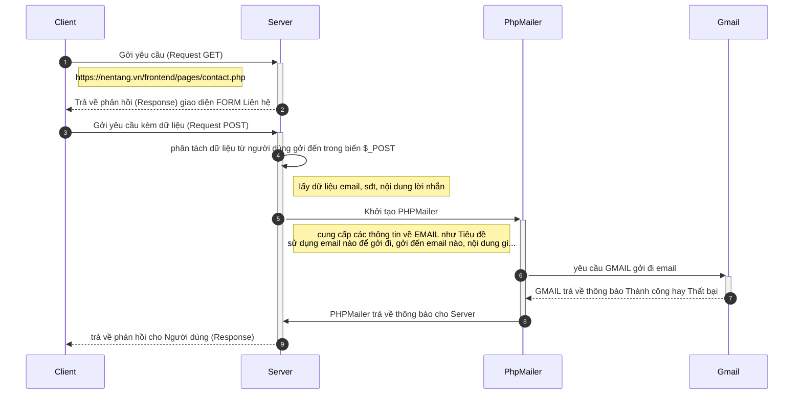

# WorkFlow chức năng Gởi mail Trang Liên hệ

```mermaid
sequenceDiagram
  autonumber
  participant C as Client
  participant S as Server
  participant P as PhpMailer
  participant G as Gmail

  C ->> +S: Gởi yêu cầu (Request GET)
  note right of C: https://nentang.vn/frontend/pages/contact.php
  S -->> -C: Trả về phản hồi (Response) giao diện FORM Liên hệ

  C ->> +S: Gởi yêu cầu kèm dữ liệu (Request POST)
  S ->> S: phân tách dữ liệu từ người dùng gởi đến trong biến $_POST
  note right of S: lấy dữ liệu email, sđt, nội dung lời nhắn
  S ->> +P: Khởi tạo PHPMailer
  note right of S: cung cấp các thông tin về EMAIL như Tiêu đề<br/>sử dụng email nào để gởi đi, gởi đến email nào, nội dung gì...
  P ->> +G: yêu cầu GMAIL gởi đi email
  G -->> -P: GMAIL trả về thông báo Thành công hay Thất bại
  P ->> -S: PHPMailer trả về thông báo cho Server
  S -->> -C: trả về phản hồi cho Người dùng (Response)

  

```
