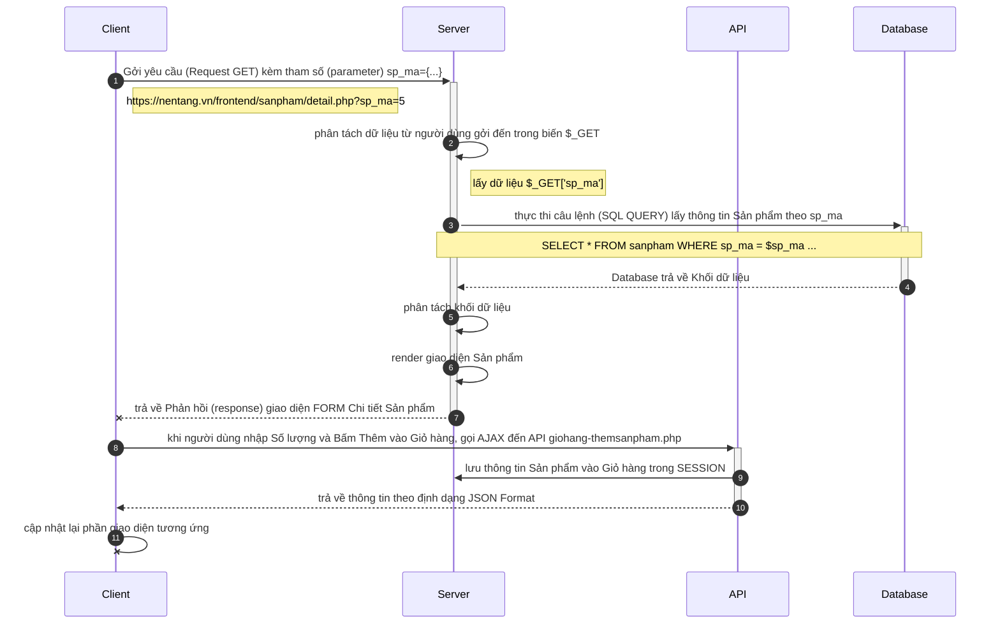

# WorkFlow chức năng Xem Chi tiết Sản phẩm

```mermaid
sequenceDiagram
  autonumber
  participant C as Client
  participant S as Server
  participant A as API
  participant DB as Database

  C ->> +S: Gởi yêu cầu (Request GET) kèm tham số (parameter) sp_ma={...}
  note right of C: https://nentang.vn/frontend/sanpham/detail.php?sp_ma=5
  
  S ->> S: phân tách dữ liệu từ người dùng gởi đến trong biến $_GET
  note right of S: lấy dữ liệu $_GET['sp_ma']
  S ->> +DB: thực thi câu lệnh (SQL QUERY) lấy thông tin Sản phẩm theo sp_ma
  note over S,DB: SELECT * FROM sanpham WHERE sp_ma = $sp_ma ...
  DB -->> -S: Database trả về Khối dữ liệu

  S ->> S: phân tách khối dữ liệu
  S ->> S: render giao diện Sản phẩm
  S --x -C: trả về Phản hồi (response) giao diện FORM Chi tiết Sản phẩm

  C ->> +A: khi người dùng nhập Số lượng và Bấm Thêm vào Giỏ hàng, gọi AJAX đến API giohang-themsanpham.php
  A ->> S: lưu thông tin Sản phẩm vào Giỏ hàng trong SESSION
  A -->> -C: trả về thông tin theo định dạng JSON Format
  C -x C: cập nhật lại phần giao diện tương ứng
```
