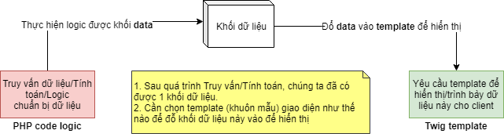

# 2.Tạo cấu hình để sử dụng TWIG
## Step 1: tạo file `bootstrap.php` để quản lý việc khởi tạo Twig
- Tạo mới file `bootstrap.php` cùng cấp với `thư mục gốc` của bạn. 
- Ví dụ thư mục gốc hiện tại trong bài học là `/php/twig/`
- Tạo file `/bootstrap.php`
```
+---php
|   \---twig                    <- Đây là thư mục gốc của dự án, các bạn có thể đặt tên các bạn...
|       +---bootstrap.php       <- Tạo file
```
- Nội dung như sau:
```php
<?php
// Load các thư viện (packages) do Composer quản lý vào chương trình
require_once __DIR__.'/vendor/autoload.php';

// Chỉ định thư mục `templates` (nơi Twig sẽ biên dịch cú pháp Twig thành các đoạn code PHP)
$loader = new Twig_Loader_Filesystem(__DIR__.'/templates');

 // Khởi tạo Twig
$twig = new Twig_Environment($loader);
```

## Step 2: tạo thư mục để chứa các templates sử dụng Twig
- Tạo mới thư mục `/templates`
```
+---php
|   \---twig                    <- Đây là thư mục gốc của dự án, các bạn có thể đặt tên các bạn...
|       +---templates           <- Tạo thư mục
```

# 3.Tạo ví dụ 1 làm quen `Twig Template Engine`
## Luồng xử lý của Template Engine thường thấy
[](../../assets/php/twig/TwigTemplateDataFlow.png)

## Step 1:
- Tạo file `/vidu1.php`
```
+---php
|   \---twig                    <- Đây là thư mục gốc của dự án, các bạn có thể đặt tên các bạn...
|       +---vidu1.php           <- Tạo file
```
- Nội dung file:
```php
<?php
// Include file cấu hình ban đầu của `Twig`
require_once __DIR__.'/bootstrap.php';

// Tạo danh sách sản phẩm mẫu
// Các bạn có thể viết các câu lệnh truy xuất vào database để lấy dữ liệu, ...
$products = [
    [
        'name'          => 'Notebook',
        'description'   => 'Core i7',
        'value'         =>  800.00,
        'date_register' => '2017-06-22',
    ],
    [
        'name'          => 'Mouse',
        'description'   => 'Razer',
        'value'         =>  125.00,
        'date_register' => '2017-10-25',
    ],
    [
        'name'          => 'Keyboard',
        'description'   => 'Mechanical Keyboard',
        'value'         =>  250.00,
        'date_register' => '2017-06-23',
    ],
];

// Yêu cầu `Twig` vẽ giao diện được viết trong file `vidu1.html.twig`
// với dữ liệu truyền vào file giao diện được đặt tên là `products`
echo $twig->render('vidu1.html.twig', ['products' => $products] );
```

## Step 2:
- Tạo file `/vidu1.php`
```
+---php
|   \---twig                    <- Đây là thư mục gốc của dự án, các bạn có thể đặt tên các bạn...
|       +---templates           
|           +---vidu1.html.twig           <- Tạo file
```
- Nội dung file:
```html
<!DOCTYPE html>
<html lang="pt-BR">
    <head>
        <meta charset="UTF-8">
        <title>Twig Example</title>
    </head>
    <body>
    <table border="1" style="width: 80%;">
        <thead>
            <tr>
                <td>Product</td>
                <td>Description</td>
                <td>Value</td>
                <td>Date</td>
            </tr>
        </thead>
        <tbody>
            
                <tr>
                    <td>{{ product.name }}</td>
                    <td>{{ product.description }}</td>
                    <td>{{ product.value }}</td>
                    <td>{{ product.date_register|date("m/d/Y") }}</td>
                </tr>
            
        </tbody>
    </table>
    </body>
</html>
```

## Step 3: Kiểm tra ứng dụng
- Truy cập địa chỉ: [http://learning.nentang.vn/php/twig/vidu1.php](http://learning.nentang.vn/php/twig/vidu1.php)

# Bài học trước
[Giới thiệu - Cài đặt](./readme.md)

# Bài học tiếp theo
[Bài học 2](./readme-lession2.md)