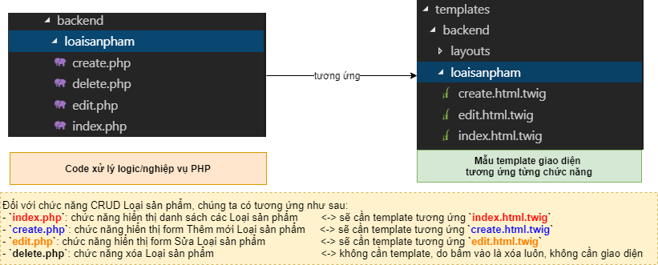

# Tạo chức năng CRUD (Thêm, Sửa, Xóa, Xem) danh mục phẳng
- Chúng ta sẽ cùng tạo chức năng CRUD (Create, Read, Update, Delete) một danh mục phẳng. Cụ thể là danh mục Loại sản phẩm

## Step 1: tạo file `dbconnect.php` để quản lý việc kết nối đến database
- Một ứng dụng web thông thường sẽ có một file quản lý kết nối đến database. Mục đích của việc tạo file quản lý kết nối chung là để thuận tiện cho việc tái sử dụng code nhiều lần. Nếu các bạn có nhu cầu thay đổi kết nối database (Hostname/IP; database name; username; password, port...) thì chỉ cần hiệu chỉnh 1 lần trong file `dbconnect.php`.
- Nhận thấy trong ứng dụng web, cả `backend` và `frontend` đều sử dụng cùng một kết nối để truy xuất đến database. Chúng ta sẽ tạo file `dbconnect.php` nằm cùng cấp với thư mục gốc để tiện quản lý.
- Tạo file `/php/twig/dbconnect.php`
```
+---php
|   \---twig                    <- Đây là thư mục gốc của dự án, các bạn có thể đặt tên các bạn...
|       \---dbconnect.php       <- Tạo file
```
- Nội dung file:
```php
<?php
// Tạo kết nối
// Tham số của hàm mysqli_connect(hostname/ip, username, password, database_name)
// 1. hostname/ip: tên host hoặc IP database server
// - ví dụ: '127.0.0.1' tương đương 'localhost': là địa chỉ máy cục bộ
//   port mặc định khi sử dụng MySQL là 3306
//   nếu sử dụng port khác, ví dụ 3307 thì giá trị truyền vào là '127.0.0.1:3307'
// 2. username: tên tài khoản được phép truy cập vào database server
// 3. password: mật khẩu tài khoản được phép truy cập vào database server
// 4. database_name: tên database bạn muốn truy cập đến
$conn = mysqli_connect('127.0.0.1', 'root', '', 'salomon') or die('Xin lỗi, database không kết nối được.');

// Tùy chỉnh kết nối
// Set charset là utf-8 đối với kết nối này. Dùng để gõ tiếng Việt, Nhật, Thái, Trung Quốc ...
// Lưu ý: gõ với bộ gõ UNIKEY, bảng mã là UNICODE
$conn->query("SET NAMES 'utf8'"); 
$conn->query("SET CHARACTER SET utf8");  
$conn->query("SET SESSION collation_connection = 'utf8_unicode_ci'"); 
```

## Step 2: tạo cấu trúc thư mục cho chức năng CRUD `Loại sản phẩm`
- Để tiện cho việc quản lý, ta sẽ tạo cấu trúc thư mục tương ứng với tên của từng chức năng

[](../../assets/php/twig/CachToChucSourceCode_Logic_TuongUng_Template.png)

- Tạo thư mục `/php/twig/backend/loaisanpham` quản lý code logic/nghiệp vụ PHP
```
+---php
|   \---twig                    <- Đây là thư mục gốc của dự án, các bạn có thể đặt tên các bạn...
|       \---backend
|           \---loaisanpham     <- Tạo thư mục
```

- Tạo thư mục `/php/twig/templates/backend/loaisanpham` quản lý template giao diện tương ứng
```
+---php
|   \---twig                    <- Đây là thư mục gốc của dự án, các bạn có thể đặt tên các bạn...
|       \---templates
|           \---backend
|               \---loaisanpham     <- Tạo thư mục
```

## Step 3: tạo chức năng `index` dùng để hiển thị màn hình danh sách các Loại sản phẩm có trong database
- Tạo file `/php/twig/backend/loaisanpham/index.php` để xử lý logic/nghiệp vụ
```
+---php
|   \---twig                    <- Đây là thư mục gốc của dự án, các bạn có thể đặt tên các bạn...
|       \---backend
|           \---loaisanpham     
|               \---index.php   <- Tạo file
```
- Nội dung file:
```php
<?php
// Include file cấu hình ban đầu của `Twig`
require_once __DIR__.'/../../bootstrap.php';

// Truy vấn database để lấy danh sách
// 1. Include file cấu hình kết nối đến database, khởi tạo kết nối $conn
include_once(__DIR__.'/../../dbconnect.php');

// 2. Chuẩn bị câu truy vấn $sql
$stt=1;
$sql = "select * from `loaisanpham`";

// 3. Thực thi câu truy vấn SQL để lấy về dữ liệu
$result = mysqli_query($conn, $sql);

// 4. Khi thực thi các truy vấn dạng SELECT, dữ liệu lấy về cần phải phân tích để sử dụng
// Thông thường, chúng ta sẽ sử dụng vòng lặp while để duyệt danh sách các dòng dữ liệu được SELECT
// Ta sẽ tạo 1 mảng array để chứa các dữ liệu được trả về
$data = [];
while($row = mysqli_fetch_array($result, MYSQLI_ASSOC))
{
    $data[] = array(
        'lsp_ma' => $row['lsp_ma'],
        'lsp_ten' => $row['lsp_ten'],
        'lsp_mota' => $row['lsp_mota'],
    );
}

// Yêu cầu `Twig` vẽ giao diện được viết trong file `backend/loaisanpham/loaisanpham.html.twig`
// với dữ liệu truyền vào file giao diện được đặt tên là `ds_loaisanpham`
echo $twig->render('backend/loaisanpham/index.html.twig', ['ds_loaisanpham' => $data] );
```
- Tạo file template cho giao diện Danh sách Loại sản phẩm `/php/twig/templates/backend/loaisanpham/index.html.twig`
```
+---php
|   \---twig                    <- Đây là thư mục gốc của dự án, các bạn có thể đặt tên các bạn...
|       \---templates
|           \---backend
|               \---loaisanpham     
|                   \---index.html.twig   <- Tạo file
```
- Nội dung file:
```html
{# Kế thừa layout backend #}


{# Nội dung trong block title #}

Danh sách Loại sản phẩm

{# End Nội dung trong block title #}

{# Nội dung trong block headline #}

Danh sách Loại sản phẩm

{# End Nội dung trong block headline #}

{# Nội dung trong block content #}

<!-- Nút thêm mới, bấm vào sẽ hiển thị form nhập thông tin Thêm mới -->
<a href="create.php" class="btn btn-primary">
    <span data-feather="plus"></span> Thêm mới
</a>
<table class="table table-bordered table-hover mt-2">
    <thead class="thead-dark">
        <tr>
            <th>Mã loại sản phẩm</th>
            <th>Tên loại sản phẩm</th>
            <th>Mô tả loại sản phẩm</th>
            <th>Hành động</th>
        </tr>
    </thead>
    <tbody>
        
        <tr>
            <td>{{ loaisanpham.lsp_ma }}</td>
            <td>{{ loaisanpham.lsp_ten }}</td>
            <td>{{ loaisanpham.lsp_mota }}</td>
            <td>
                <!-- Nút sửa, bấm vào sẽ hiển thị form hiệu chỉnh thông tin dựa vào khóa chính `lsp_ma` -->
                <a href="edit.php?lsp_ma={{ loaisanpham.lsp_ma }}" class="btn btn-warning">
                    <span data-feather="edit"></span> Sửa
                </a>

                <!-- Nút xóa, bấm vào sẽ xóa thông tin dựa vào khóa chính `lsp_ma` -->
                <a href="delete.php?lsp_ma={{ loaisanpham.lsp_ma }}" class="btn btn-danger">
                    <span data-feather="delete"></span> Xóa
                </a>
            </td>
        </tr>
        
    </tbody>
</table>

{# End Nội dung trong block content #}
```

## Step 4: tạo chức năng `create` dùng để hiển thị màn hình form thêm mới Loại sản phẩm
- Tạo file `/php/twig/backend/loaisanpham/create.php` để xử lý logic/nghiệp vụ
```
+---php
|   \---twig                    <- Đây là thư mục gốc của dự án, các bạn có thể đặt tên các bạn...
|       \---backend
|           \---loaisanpham     
|               \---create.php   <- Tạo file
```
- Nội dung file:
```php
<?php
// Include file cấu hình ban đầu của `Twig`
require_once __DIR__.'/../../bootstrap.php';

// Truy vấn database
// 1. Include file cấu hình kết nối đến database, khởi tạo kết nối $conn
include_once(__DIR__.'/../../dbconnect.php');

// 2. Nếu người dùng có bấm nút Đăng ký thì thực thi câu lệnh UPDATE
if(isset($_POST['btnCapNhat'])) 
{
    // Lấy dữ liệu người dùng hiệu chỉnh gởi từ REQUEST POST
    $tenLoai = $_POST['lsp_ten'];
    $mota = $_POST['lsp_mota'];

    // Câu lệnh INSERT
    $sql = "INSERT INTO `loaisanpham` (lsp_ten, lsp_mota) VALUES ('" . $tenLoai . "', '". $mota ."');";

    // Thực thi INSERT
    mysqli_query($conn, $sql);

    // Đóng kết nối
    mysqli_close($conn);

    // Sau khi cập nhật dữ liệu, tự động điều hướng về trang Danh sách
    header('location:index.php');
}

// Yêu cầu `Twig` vẽ giao diện được viết trong file `backend/loaisanpham/create.html.twig`
echo $twig->render('backend/loaisanpham/create.html.twig');
```

- Tạo file template cho giao diện Thêm mới Loại sản phẩm `/php/twig/templates/backend/loaisanpham/create.html.twig`
```
+---php
|   \---twig                    <- Đây là thư mục gốc của dự án, các bạn có thể đặt tên các bạn...
|       \---templates
|           \---backend
|               \---loaisanpham     
|                   \---create.html.twig   <- Tạo file
```
- Nội dung file:
```html
{# Kế thừa layout backend #}


{# Nội dung trong block title #}

Thêm mới Loại sản phẩm

{# End Nội dung trong block title #}

{# Nội dung trong block headline #}

Thêm mới Loại sản phẩm

{# End Nội dung trong block headline #}

{# Nội dung trong block content #}

<form name="frmLoaiSanPham" id="frmLoaiSanPham" method="post" action="/php/twig/backend/loaisanpham/create.php">
    <div class="form-group">
        <label for="lsp_ma">Mã loại sản phẩm</label>
        <input type="text" class="form-control" id="lsp_ma" name="lsp_ma" placeholder="Mã loại sản phẩm" readonly>
        <small id="lsp_maHelp" class="form-text text-muted">Mã loại sản phẩm không được hiệu chỉnh.</small>
    </div>
    <div class="form-group">
        <label for="lsp_ten">Tên loại sản phẩm</label>
        <input type="text" class="form-control" id="lsp_ten" name="lsp_ten" placeholder="Tên loại sản phẩm">
    </div>
    <div class="form-group">
        <label for="lsp_mota">Mô tả loại sản phẩm</label>
        <input type="text" class="form-control" id="lsp_mota" name="lsp_mota" placeholder="Mô tả loại sản phẩm">
    </div>
    <button type="submit" class="btn btn-primary" name="btnCapNhat">Cập nhật</button>
</form>

{# End Nội dung trong block content #}
```

## Step 5: tạo chức năng `edit` dùng để hiển thị màn hình form sửa Loại sản phẩm
- Tạo file `/php/twig/backend/loaisanpham/edit.php` để xử lý logic/nghiệp vụ
```
+---php
|   \---twig                    <- Đây là thư mục gốc của dự án, các bạn có thể đặt tên các bạn...
|       \---backend
|           \---loaisanpham     
|               \---edit.php   <- Tạo file
```
- Nội dung file:
```php
<?php
// Include file cấu hình ban đầu của `Twig`
require_once __DIR__.'/../../bootstrap.php';

// Truy vấn database
// 1. Include file cấu hình kết nối đến database, khởi tạo kết nối $conn
include_once(__DIR__.'/../../dbconnect.php');

// 2. Chuẩn bị câu truy vấn $sqlSelect, lấy dữ liệu ban đầu của record cần update
// Lấy giá trị khóa chính được truyền theo dạng QueryString Parameter key1=value1&key2=value2...
$lsp_ma = $_GET['lsp_ma'];
$sqlSelect = "SELECT * FROM `loaisanpham` WHERE lsp_ma=$lsp_ma;";

// 3. Thực thi câu truy vấn SQL để lấy về dữ liệu ban đầu của record cần update
$resultSelect = mysqli_query($conn, $sqlSelect);
$loaisanphamRow = mysqli_fetch_array($resultSelect, MYSQLI_ASSOC); // 1 record

// 4. Nếu người dùng có bấm nút Đăng ký thì thực thi câu lệnh UPDATE
if(isset($_POST['btnCapNhat'])) 
{
    // Lấy dữ liệu người dùng hiệu chỉnh gởi từ REQUEST POST
    $tenLoai = $_POST['lsp_ten'];
    $mota = $_POST['lsp_mota'];

    // Câu lệnh UPDATE
    $sql = "UPDATE `loaisanpham` SET lsp_ten='$tenLoai', lsp_mota='$mota' WHERE lsp_ma=$lsp_ma;";

    // Thực thi UPDATE
    mysqli_query($conn, $sql);

    // Đóng kết nối
    mysqli_close($conn);

    // Sau khi cập nhật dữ liệu, tự động điều hướng về trang Danh sách
    header('location:index.php');
}

// Yêu cầu `Twig` vẽ giao diện được viết trong file `backend/loaisanpham/edit.html.twig`
// với dữ liệu truyền vào file giao diện được đặt tên là `loaisanpham`
echo $twig->render('backend/loaisanpham/edit.html.twig', ['loaisanpham' => $loaisanphamRow] );
```

- Tạo file template cho giao diện Sửa Loại sản phẩm `/php/twig/templates/backend/loaisanpham/edit.html.twig`
```
+---php
|   \---twig                    <- Đây là thư mục gốc của dự án, các bạn có thể đặt tên các bạn...
|       \---templates
|           \---backend
|               \---loaisanpham     
|                   \---edit.html.twig   <- Tạo file
```
- Nội dung file:
```html
{# Kế thừa layout backend #}


{# Nội dung trong block title #}

Sửa Loại sản phẩm

{# End Nội dung trong block title #}

{# Nội dung trong block headline #}

Sửa Loại sản phẩm

{# End Nội dung trong block headline #}

{# Nội dung trong block content #}

<form name="frmLoaiSanPham" id="frmLoaiSanPham" method="post" action="/php/twig/backend/loaisanpham/edit.php?lsp_ma={{ loaisanpham.lsp_ma }}">
    <div class="form-group">
        <label for="lsp_ma">Mã loại sản phẩm</label>
        <input type="text" class="form-control" id="lsp_ma" name="lsp_ma" placeholder="Mã loại sản phẩm" readonly value="{{ loaisanpham.lsp_ma }}">
        <small id="lsp_maHelp" class="form-text text-muted">Mã loại sản phẩm không được hiệu chỉnh.</small>
    </div>
    <div class="form-group">
        <label for="lsp_ten">Tên loại sản phẩm</label>
        <input type="text" class="form-control" id="lsp_ten" name="lsp_ten" placeholder="Tên loại sản phẩm" value="{{ loaisanpham.lsp_ten }}">
    </div>
    <div class="form-group">
        <label for="lsp_mota">Mô tả loại sản phẩm</label>
        <input type="text" class="form-control" id="lsp_mota" name="lsp_mota" placeholder="Mô tả loại sản phẩm" value="{{ loaisanpham.lsp_mota }}">
    </div>
    <button type="submit" class="btn btn-primary" name="btnCapNhat">Cập nhật</button>
</form>

{# End Nội dung trong block content #}
```

## Step 6: tạo chức năng `delete` dùng để xóa Loại sản phẩm
- Tạo file `/php/twig/backend/loaisanpham/delete.php` để xử lý logic/nghiệp vụ
```
+---php
|   \---twig                    <- Đây là thư mục gốc của dự án, các bạn có thể đặt tên các bạn...
|       \---backend
|           \---loaisanpham     
|               \---delete.php   <- Tạo file
```
- Nội dung file:
```php
<?php
// Truy vấn database
// 1. Include file cấu hình kết nối đến database, khởi tạo kết nối $conn
include_once(__DIR__.'/../../dbconnect.php');

// 2. Chuẩn bị câu truy vấn $sql
// Lấy giá trị khóa chính được truyền theo dạng QueryString Parameter key1=value1&key2=value2...
$lsp_ma = $_GET['lsp_ma'];
$sql = "DELETE FROM `loaisanpham` WHERE lsp_ma=" . $lsp_ma;

// 3. Thực thi câu lệnh DELETE
$result = mysqli_query($conn, $sql);

// 4. Đóng kết nối
mysqli_close($conn);
    
// Sau khi cập nhật dữ liệu, tự động điều hướng về trang Danh sách
header('location:index.php');
```

## Step 7: tạo menu chức năng Loại sản phẩm bên thành phần `sidebar`
- Hiệu chỉnh file `/php/twig/templates/backend/layouts/includes/sidebar.html.twig`
```html
<nav class="col-md-2 d-none d-md-block bg-light sidebar">
    <div class="sidebar-sticky">
        <ul class="nav flex-column">
            <li class="nav-item">
                <a class="nav-link active" href="/php/twig/backend/pages/dashboard.php">
                    <span data-feather="home"></span>
                    Bảng tin <span class="sr-only">(current)</span>
                </a>
            </li>
          
            <!-- Menu Loại sản phẩm -->
            <li class="nav-item">
                <a href="#loaisanphamSubMenu" data-toggle="collapse" aria-expanded="false" class="nav-link dropdown-toggle">
                    <span data-feather="package"></span> Loại sản phẩm
                </a>
                <ul class="collapse" id="loaisanphamSubMenu">
                    <li class="nav-item">
                        <a class="nav-link" href="/php/twig/backend/loaisanpham/index.php">
                            <span data-feather="list"></span>
                            Danh sách
                        </a>
                    </li>
                    <li class="nav-item">
                        <a class="nav-link" href="/php/twig/backend/loaisanpham/create.php">
                            <span data-feather="plus"></span>
                            Thêm mới
                        </a>
                    </li>
                </ul>
            </li>
            <!-- End Menu Loại sản phẩm -->
        </ul>
    </div>
</nav>
```

## Kiểm tra ứng dụng
- Truy cập địa chỉ: [http://learning.nentang.vn/php/twig//backend/loaisanpham/index.php](http://learning.nentang.vn/php/twig//backend/loaisanpham/index.php)

## Yêu cầu
- Thực hiện tạo các chức năng Danh mục phẳng tương tự:
    - `chudegopy`
    - `hinhthucthanhtoan`
    - `khuyenmai`
    - `nhasanxuat`

# Bài học trước
[Bài học 3](./readme-lession3.md)

# Bài học tiếp theo
[Bài học 5](./readme-lession5.md)