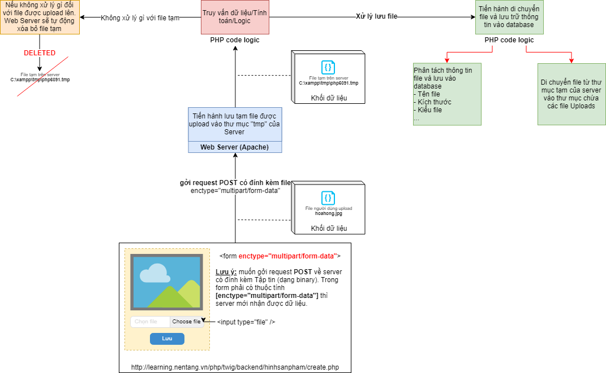

# Tạo chức năng CRUD (Thêm, Sửa, Xóa, Xem) upload hình Sản phẩm (upload đơn, mỗi lần 1 file)

- Để upload file lên Server thì chúng ta phải sử dụng form có thuộc tính `enctype="multipart/form-data"` và phương thức `POST`, thẻ input sẽ có `type="file"`.
- Khi chúng ta upload một file lên thì trên Server sẽ nhận được 5 thông số cho một file, và PHP sẽ dựa vào các thông số đó để tiến hành upload, các thông số đó là:
    - `name`: Tên của file chúng ta upload
    - `type`: Kiểu file mà chúng ta upload (hình ảnh, word, …)
    - `tmp_name`: Đường dẫn đến file tạm trên web server
    - `error`: Trạng thái của file chúng ta upload, 0 => không có lỗi
    - `size`: Kích thước của file chúng ta upload

## Lưu đồ hoạt động của quá trình Upload file từ Client lên Server
[](../../assets/php/twig/UploadFileWorkFlow.png)

## Step 1: tạo thư mục dùng để chứa các file UPLOADS
- Để tiện cho việc quản lý, ta sẽ tạo thư mục dùng để chứa các file được upload từ Clients

- Tạo thư mục `/php/twig/assets/uploads` chứa các file được upload từ Clients
```
+---php
|   \---twig                    <- Đây là thư mục gốc của dự án, các bạn có thể đặt tên các bạn...
|       \---assets
|           \---uploads         <- Tạo thư mục
```

## Step 2: tạo chức năng `create` dùng để hiển thị màn hình form thêm mới Hình Sản phẩm
- Tạo file `/php/twig/backend/hinhsanpham/create.php` để xử lý logic/nghiệp vụ
```
+---php
|   \---twig                    <- Đây là thư mục gốc của dự án, các bạn có thể đặt tên các bạn...
|       \---backend
|           \---hinhsanpham     
|               \---create.php   <- Tạo file
```
- Nội dung file:
```php
<?php
// Include file cấu hình ban đầu của `Twig`
require_once __DIR__.'/../../bootstrap.php';

// Truy vấn database
// 1. Include file cấu hình kết nối đến database, khởi tạo kết nối $conn
include_once(__DIR__.'/../../dbconnect.php');

/* --- 
   --- 2.Truy vấn dữ liệu sản phẩm 
   --- 
*/
// Chuẩn bị câu truy vấn sản phẩm
$sqlSanPham = "select * from `sanpham`";

// Thực thi câu truy vấn SQL để lấy về dữ liệu
$resultSanPham = mysqli_query($conn, $sqlSanPham);

// Khi thực thi các truy vấn dạng SELECT, dữ liệu lấy về cần phải phân tích để sử dụng
// Thông thường, chúng ta sẽ sử dụng vòng lặp while để duyệt danh sách các dòng dữ liệu được SELECT
// Ta sẽ tạo 1 mảng array để chứa các dữ liệu được trả về
$dataSanPham = [];
while($rowSanPham = mysqli_fetch_array($resultSanPham, MYSQLI_ASSOC))
{
    // Sử dụng hàm sprintf() để chuẩn bị mẫu câu với các giá trị truyền vào tương ứng từng vị trí placeholder
    $sp_tomtat = sprintf("Sản phẩm %s, giá: %d", 
        $rowSanPham['product_name'],
        number_format($rowSanPham['sp_gia'], 2, ".", ",") . ' vnđ');

    $dataSanPham[] = array(
        'sp_ma' => $rowSanPham['sp_ma'],
        'sp_tomtat' => $sp_tomtat
    );
}
/* --- End Truy vấn dữ liệu sản phẩm --- */

// 3. Nếu người dùng có bấm nút Đăng ký thì thực thi câu lệnh UPDATE
if(isset($_POST['btnSave'])) 
{
    // Lấy dữ liệu người dùng hiệu chỉnh gởi từ REQUEST POST
    $sp_ma = $_POST['sp_ma'];

    // Nếu người dùng có chọn file để upload
    if (isset($_FILES['hproduct_nametaptin']))
    {
        // Đường dẫn để chứa thư mục upload trên ứng dụng web của chúng ta. Các bạn có thể tùy chỉnh theo ý các bạn.
        // Ví dụ: các file upload sẽ được lưu vào thư mục ../../assets/uploads
        $upload_dir = "./../../assets/uploads/";

        // Đối với mỗi file, sẽ có các thuộc tính như sau:
        // $_FILES['hproduct_nametaptin']['name']     : Tên của file chúng ta upload
        // $_FILES['hproduct_nametaptin']['type']     : Kiểu file mà chúng ta upload (hình ảnh, word, excel, pdf, txt, ...)
        // $_FILES['hproduct_nametaptin']['tmp_name'] : Đường dẫn đến file tạm trên web server
        // $_FILES['hproduct_nametaptin']['error']    : Trạng thái của file chúng ta upload, 0 => không có lỗi
        // $_FILES['hproduct_nametaptin']['size']     : Kích thước của file chúng ta upload

        // Nếu file upload bị lỗi, tức là thuộc tính error > 0
        if ($_FILES['hproduct_nametaptin']['error'] > 0)
        {
            echo 'File Upload Bị Lỗi';die;
        }
        else{
            // Tiến hành di chuyển file từ thư mục tạm trên server vào thư mục chúng ta muốn chứa các file uploads
            // Ví dụ: move file từ C:\xampp\tmp\php6091.tmp -> C:/xampp/htdocs/learning.nentang.vn/php/twig/assets/uploads/hoahong.jpg
            $hproduct_nametaptin = $_FILES['hproduct_nametaptin']['name'];
            move_uploaded_file($_FILES['hproduct_nametaptin']['tmp_name'], $upload_dir.$hproduct_nametaptin);
            echo 'File Uploaded';
        }

        // Câu lệnh INSERT
        $sql = "INSERT INTO `hinhsanpham` (hproduct_nametaptin, sp_ma) VALUES ('$hproduct_nametaptin', $sp_ma);";
        
        // Thực thi INSERT
        mysqli_query($conn, $sql);
            
        // Đóng kết nối
        mysqli_close($conn);

        // Sau khi cập nhật dữ liệu, tự động điều hướng về trang Danh sách
        header('location:index.php');
    }
}

// Yêu cầu `Twig` vẽ giao diện được viết trong file `backend/hinhsanpham/create.html.twig`
echo $twig->render('backend/hinhsanpham/create.html.twig', [
    'ds_sanpham' => $dataSanPham,
]);
```

- Tạo file template cho giao diện Thêm mới Hình Sản phẩm `/php/twig/templates/backend/hinhsanpham/create.html.twig`
```
+---php
|   \---twig                    <- Đây là thư mục gốc của dự án, các bạn có thể đặt tên các bạn...
|       \---templates
|           \---backend
|               \---hinhsanpham     
|                   \---create.html.twig   <- Tạo file
```
- Nội dung file:
```html
{# Kế thừa layout backend #}


{# Nội dung trong block title #}

Thêm mới Hình Sản phẩm

{# End Nội dung trong block title #}

{# Nội dung trong block headline #}

Thêm mới Hình Sản phẩm

{# End Nội dung trong block headline #}

{# Nội dung trong block content #}

<form name="frmhinhsanpham" id="frmhinhanpham" method="post" action="/php/twig/backend/hinhsanpham/create.php" enctype="multipart/form-data">
    <div class="form-group">
        <label for="sp_ma">Sản phẩm</label>
        <select class="form-control" id="sp_ma" name="sp_ma">
            
            <option value="{{ sanpham.sp_ma }}">{{ sanpham.sp_tomtat }}</option>
            
        </select>
    </div>
    <div class="form-group">
        <label for="hproduct_nametaptin">Tập tin ảnh</label>
        <input type="file" class="form-control" id="hproduct_nametaptin" name="hproduct_nametaptin">
    </div>
    <button class="btn btn-primary" name="btnSave">Cập nhật</button>
</form>

{# End Nội dung trong block content #}
```

## Step 3: tạo chức năng `index` dùng để hiển thị màn hình danh sách các Hình sản phẩm có trong database
- Tạo file `/php/twig/backend/hinhsanpham/index.php` để xử lý logic/nghiệp vụ
```
+---php
|   \---twig                    <- Đây là thư mục gốc của dự án, các bạn có thể đặt tên các bạn...
|       \---backend
|           \---hinhsanpham     
|               \---index.php   <- Tạo file
```
- Nội dung file:
```php
<?php
// Include file cấu hình ban đầu của `Twig`
require_once __DIR__.'/../../bootstrap.php';
// Truy vấn database để lấy danh sách
// 1. Include file cấu hình kết nối đến database, khởi tạo kết nối $conn
include_once(__DIR__.'/../../dbconnect.php');
// 2. Chuẩn bị câu truy vấn $sql
// Sử dụng HEREDOC của PHP để tạo câu truy vấn SQL với dạng dễ đọc, thân thiện với việc bảo trì code
$sql = <<<EOT
    SELECT *
    FROM `hinhsanpham` hsp
    JOIN `sanpham` sp on hsp.sp_ma = sp.sp_ma
EOT;

// 3. Thực thi câu truy vấn SQL để lấy về dữ liệu
$result = mysqli_query($conn, $sql);
// 4. Khi thực thi các truy vấn dạng SELECT, dữ liệu lấy về cần phải phân tích để sử dụng
// Thông thường, chúng ta sẽ sử dụng vòng lặp while để duyệt danh sách các dòng dữ liệu được SELECT
// Ta sẽ tạo 1 mảng array để chứa các dữ liệu được trả về
$data = [];
while($row = mysqli_fetch_array($result, MYSQLI_ASSOC))
{
    // Sử dụng hàm sprintf() để chuẩn bị mẫu câu với các giá trị truyền vào tương ứng từng vị trí placeholder
    $sp_tomtat = sprintf("Sản phẩm %s, giá: %d", 
        $row['product_name'],
        number_format($row['sp_gia'], 2, ".", ",") . ' vnđ');

    $data[] = array(
        'hsp_ma' => $row['hsp_ma'],
        'hproduct_nametaptin' => $row['hproduct_nametaptin'],
        'sp_tomtat' => $sp_tomtat,
    );
}
// Yêu cầu `Twig` vẽ giao diện được viết trong file `backend/hinhsanpham/index.html.twig`
// với dữ liệu truyền vào file giao diện được đặt tên là `ds_hinhsanpham`
echo $twig->render('backend/hinhsanpham/index.html.twig', ['ds_hinhsanpham' => $data] );
```
- Tạo file template cho giao diện Danh sách Hình sản phẩm `/php/twig/templates/backend/hinhsanpham/index.html.twig`
```
+---php
|   \---twig                    <- Đây là thư mục gốc của dự án, các bạn có thể đặt tên các bạn...
|       \---templates
|           \---backend
|               \---hinhsanpham     
|                   \---index.html.twig   <- Tạo file
```
- Nội dung file:
```html
{# Kế thừa layout backend #}


{# Nội dung trong block title #}

Danh sách Hình Sản phẩm

{# End Nội dung trong block title #}

{# Nội dung trong block headline #}

Danh sách Hình Sản phẩm

{# End Nội dung trong block headline #}

{# Nội dung trong block content #}

<!-- Nút thêm mới, bấm vào sẽ hiển thị form nhập thông tin Thêm mới -->
<a href="create.php" class="btn btn-primary">
    <span data-feather="plus"></span> Thêm mới
</a>
<table class="table table-bordered table-hover mt-2">
    <thead class="thead-dark">
        <tr>
            <th>Mã Hình Sản phẩm</th>
            <th>Hình ảnh</th>
            <th>Sản phẩm</th>
            <th>Hành động</th>
        </tr>
    </thead>
    <tbody>
        
        <tr>
            <td>{{ hinhsanpham.hsp_ma }}</td>
            <td>
                
            </td>
            <td>{{ hinhsanpham.sp_tomtat }}</td>
            <td>
                <!-- Nút sửa, bấm vào sẽ hiển thị form hiệu chỉnh thông tin dựa vào khóa chính `hsp_ma` -->
                <a href="edit.php?hsp_ma={{ hinhsanpham.hsp_ma }}" class="btn btn-warning">
                    <span data-feather="edit"></span> Sửa
                </a>

                <!-- Nút xóa, bấm vào sẽ xóa thông tin dựa vào khóa chính `sp_ma` -->
                <a href="delete.php?hsp_ma={{ hinhsanpham.hsp_ma }}" class="btn btn-danger">
                    <span data-feather="delete"></span> Xóa
                </a>
            </td>
        </tr>
        
    </tbody>
</table>

{# End Nội dung trong block content #}
```

## Step 4: tạo chức năng `edit` dùng để hiển thị màn hình form sửa Hình Sản phẩm
- Tạo file `/php/twig/backend/hinhsanpham/edit.php` để xử lý logic/nghiệp vụ
```
+---php
|   \---twig                    <- Đây là thư mục gốc của dự án, các bạn có thể đặt tên các bạn...
|       \---backend
|           \---hinhsanpham     
|               \---edit.php   <- Tạo file
```
- Nội dung file:
```php
<?php
// Include file cấu hình ban đầu của `Twig`
require_once __DIR__.'/../../bootstrap.php';

// Truy vấn database
// 1. Include file cấu hình kết nối đến database, khởi tạo kết nối $conn
include_once(__DIR__.'/../../dbconnect.php');

/* --- 
   --- 2.Truy vấn dữ liệu sản phẩm 
   --- 
*/
// Chuẩn bị câu truy vấn sản phẩm
$sqlSanPham = "select * from `sanpham`";

// Thực thi câu truy vấn SQL để lấy về dữ liệu
$resultSanPham = mysqli_query($conn, $sqlSanPham);

// Khi thực thi các truy vấn dạng SELECT, dữ liệu lấy về cần phải phân tích để sử dụng
// Thông thường, chúng ta sẽ sử dụng vòng lặp while để duyệt danh sách các dòng dữ liệu được SELECT
// Ta sẽ tạo 1 mảng array để chứa các dữ liệu được trả về
$dataSanPham = [];
while($rowSanPham = mysqli_fetch_array($resultSanPham, MYSQLI_ASSOC))
{
    // Sử dụng hàm sprintf() để chuẩn bị mẫu câu với các giá trị truyền vào tương ứng từng vị trí placeholder
    $sp_tomtat = sprintf("Sản phẩm %s, giá: %d", 
        $rowSanPham['product_name'],
        number_format($rowSanPham['sp_gia'], 2, ".", ",") . ' vnđ');

    $dataSanPham[] = array(
        'sp_ma' => $rowSanPham['sp_ma'],
        'sp_tomtat' => $sp_tomtat
    );
}
/* --- End Truy vấn dữ liệu sản phẩm --- */

/* --- 
   --- 3. Truy vấn dữ liệu Sản phẩm theo khóa chính
   --- 
*/
// Chuẩn bị câu truy vấn $sqlSelect, lấy dữ liệu ban đầu của record cần update
// Lấy giá trị khóa chính được truyền theo dạng QueryString Parameter key1=value1&key2=value2...
$hsp_ma = $_GET['hsp_ma'];
$sqlSelect = "SELECT * FROM `hinhsanpham` WHERE hsp_ma=$hsp_ma;";

// Thực thi câu truy vấn SQL để lấy về dữ liệu ban đầu của record cần update
$resultSelect = mysqli_query($conn, $sqlSelect);
$hinhsanphamRow = mysqli_fetch_array($resultSelect, MYSQLI_ASSOC); // 1 record
/* --- End Truy vấn dữ liệu Sản phẩm theo khóa chính --- */

// 4. Nếu người dùng có bấm nút Đăng ký thì thực thi câu lệnh UPDATE
if(isset($_POST['btnSave'])) 
{
    // Lấy dữ liệu người dùng hiệu chỉnh gởi từ REQUEST POST
    $sp_ma = $_POST['sp_ma'];

    // Nếu người dùng có chọn file để upload
    if (isset($_FILES['hproduct_nametaptin']))
    {
        // Đường dẫn để chứa thư mục upload trên ứng dụng web của chúng ta. Các bạn có thể tùy chỉnh theo ý các bạn.
        // Ví dụ: các file upload sẽ được lưu vào thư mục ../../assets/uploads
        $upload_dir = "./../../assets/uploads/";

        // Đối với mỗi file, sẽ có các thuộc tính như sau:
        // $_FILES['hproduct_nametaptin']['name']     : Tên của file chúng ta upload
        // $_FILES['hproduct_nametaptin']['type']     : Kiểu file mà chúng ta upload (hình ảnh, word, excel, pdf, txt, ...)
        // $_FILES['hproduct_nametaptin']['tmp_name'] : Đường dẫn đến file tạm trên web server
        // $_FILES['hproduct_nametaptin']['error']    : Trạng thái của file chúng ta upload, 0 => không có lỗi
        // $_FILES['hproduct_nametaptin']['size']     : Kích thước của file chúng ta upload

        // Nếu file upload bị lỗi, tức là thuộc tính error > 0
        if ($_FILES['hproduct_nametaptin']['error'] > 0)
        {
            echo 'File Upload Bị Lỗi';die;
        }
        else{
            // Tiến hành di chuyển file từ thư mục tạm trên server vào thư mục chúng ta muốn chứa các file uploads
            // Ví dụ: move file từ C:\xampp\tmp\php6091.tmp -> C:/xampp/htdocs/learning.nentang.vn/php/twig/assets/uploads/hoahong.jpg
            $hproduct_nametaptin = $_FILES['hproduct_nametaptin']['name'];
            move_uploaded_file($_FILES['hproduct_nametaptin']['tmp_name'], $upload_dir.$hproduct_nametaptin);
            
            // Xóa file cũ để tránh rác trong thư mục UPLOADS
            $old_file = $upload_dir.$hinhsanphamRow['hproduct_nametaptin'];
            if(file_exists($old_file)) {
                unlink($old_file);
            }
        }

        // Câu lệnh UPDATE
        $sql = "UPDATE `hinhsanpham` SET hproduct_nametaptin='$hproduct_nametaptin', sp_ma=$sp_ma WHERE hsp_ma=$hsp_ma;";
        
        // Thực thi UPDATE
        mysqli_query($conn, $sql);
            
        // Đóng kết nối
        mysqli_close($conn);

        // Sau khi cập nhật dữ liệu, tự động điều hướng về trang Danh sách
        header('location:index.php');
    }
}

// Yêu cầu `Twig` vẽ giao diện được viết trong file `backend/hinhsanpham/edit.html.twig`
echo $twig->render('backend/hinhsanpham/edit.html.twig', [
    'ds_sanpham' => $dataSanPham,
    'hinhsanpham' => $hinhsanphamRow,
]);
```

- Tạo file template cho giao diện Sửa Hình sản phẩm `/php/twig/templates/backend/hinhsanpham/edit.html.twig`
```
+---php
|   \---twig                    <- Đây là thư mục gốc của dự án, các bạn có thể đặt tên các bạn...
|       \---templates
|           \---backend
|               \---hinhsanpham     
|                   \---edit.html.twig   <- Tạo file
```
- Nội dung file:
```html
{# Kế thừa layout backend #}


{# Nội dung trong block title #}

Sửa Hình Sản phẩm

{# End Nội dung trong block title #}

{# Nội dung trong block headline #}

Sửa Hình Sản phẩm

{# End Nội dung trong block headline #}

{# Nội dung trong block content #}

<form name="frmhinhsanpham" id="frmhinhanpham" method="post" action="/php/twig/backend/hinhsanpham/edit.php?hsp_ma={{ hinhsanpham.hsp_ma }}" enctype="multipart/form-data">
    <div class="form-group">
        <label for="">Hình ảnh</label>
        <br />
        
    </div>
    <div class="form-group">
        <label for="sp_ma">Sản phẩm</label>
        <select class="form-control" id="sp_ma" name="sp_ma">
            
                
                <option value="{{ sanpham.sp_ma }}" selected>{{ sanpham.sp_tomtat }}</option>
                
                <option value="{{ sanpham.sp_ma }}">{{ sanpham.sp_tomtat }}</option>
                
            
        </select>
    </div>
    <div class="form-group">
        <label for="hproduct_nametaptin">Tập tin ảnh</label>
        <input type="file" class="form-control" id="hproduct_nametaptin" name="hproduct_nametaptin">
    </div>
    <button class="btn btn-primary" name="btnSave">Cập nhật</button>
</form>

{# End Nội dung trong block content #}
```

## Step 5: tạo chức năng `delete` dùng để xóa Hình Sản phẩm
- Tạo file `/php/twig/backend/hinhsanpham/delete.php` để xử lý logic/nghiệp vụ
```
+---php
|   \---twig                    <- Đây là thư mục gốc của dự án, các bạn có thể đặt tên các bạn...
|       \---backend
|           \---hinhsanpham     
|               \---delete.php   <- Tạo file
```
- Nội dung file:
```php
<?php
// Truy vấn database
// 1. Include file cấu hình kết nối đến database, khởi tạo kết nối $conn
include_once(__DIR__.'/../../dbconnect.php');

/* --- 
   --- 2. Truy vấn dữ liệu Sản phẩm theo khóa chính
   --- 
*/
// Chuẩn bị câu truy vấn $sqlSelect, lấy dữ liệu ban đầu của record cần update
// Lấy giá trị khóa chính được truyền theo dạng QueryString Parameter key1=value1&key2=value2...
$hsp_ma = $_GET['hsp_ma'];
$sqlSelect = "SELECT * FROM `hinhsanpham` WHERE hsp_ma=$hsp_ma;";

// Thực thi câu truy vấn SQL để lấy về dữ liệu ban đầu của record cần update
$resultSelect = mysqli_query($conn, $sqlSelect);
$hinhsanphamRow = mysqli_fetch_array($resultSelect, MYSQLI_ASSOC); // 1 record
/* --- End Truy vấn dữ liệu Sản phẩm theo khóa chính --- */

// 3. Chuẩn bị câu truy vấn $sql
// Lấy giá trị khóa chính được truyền theo dạng QueryString Parameter key1=value1&key2=value2...
$hsp_ma = $_GET['hsp_ma'];
$sql = "DELETE FROM `hinhsanpham` WHERE hsp_ma=" . $hsp_ma;

// 4. Thực thi câu lệnh DELETE
$result = mysqli_query($conn, $sql);

// 5. Xóa file cũ để tránh rác trong thư mục UPLOADS
// Đường dẫn để chứa thư mục upload trên ứng dụng web của chúng ta. Các bạn có thể tùy chỉnh theo ý các bạn.
// Ví dụ: các file upload sẽ được lưu vào thư mục ../../assets/uploads
$upload_dir = "./../../assets/uploads/";

$old_file = $upload_dir.$hinhsanphamRow['hproduct_nametaptin'];
if(file_exists($old_file)) {
    unlink($old_file);
}

// 6. Đóng kết nối
mysqli_close($conn);
    
// Sau khi cập nhật dữ liệu, tự động điều hướng về trang Danh sách
header('location:index.php');
```

## Step 6: tạo chức năng `delete` dùng để xóa Loại sản phẩm
- Tạo file `/php/twig/backend/loaisanpham/delete.php` để xử lý logic/nghiệp vụ
```
+---php
|   \---twig                    <- Đây là thư mục gốc của dự án, các bạn có thể đặt tên các bạn...
|       \---backend
|           \---loaisanpham     
|               \---delete.php   <- Tạo file
```
- Nội dung file:
```php
<?php
// Truy vấn database
// 1. Include file cấu hình kết nối đến database, khởi tạo kết nối $conn
include_once(__DIR__.'/../../dbconnect.php');

// 2. Chuẩn bị câu truy vấn $sql
// Lấy giá trị khóa chính được truyền theo dạng QueryString Parameter key1=value1&key2=value2...
$lsp_ma = $_GET['lsp_ma'];
$sql = "DELETE FROM `loaisanpham` WHERE lsp_ma=" . $lsp_ma;

// 3. Thực thi câu lệnh DELETE
$result = mysqli_query($conn, $sql);

// 4. Đóng kết nối
mysqli_close($conn);
    
// Sau khi cập nhật dữ liệu, tự động điều hướng về trang Danh sách
header('location:index.php');
```

## Step 6: tạo menu chức năng Hinh sản phẩm bên thành phần `sidebar`
- Hiệu chỉnh file `/php/twig/templates/backend/layouts/includes/sidebar.html.twig`
```html
<nav class="col-md-2 d-none d-md-block bg-light sidebar">
    <div class="sidebar-sticky">
        <ul class="nav flex-column">
            <li class="nav-item">
                <a class="nav-link active" href="/php/twig/backend/pages/dashboard.php">
                    <span data-feather="home"></span>
                    Bảng tin <span class="sr-only">(current)</span>
                </a>
            </li>
          
            <!-- Menu Hình Sản phẩm -->
            <li class="nav-item">
                <a href="#hinhsanphamSubMenu" data-toggle="collapse" aria-expanded="false" class="nav-link dropdown-toggle">
                    <span data-feather="package"></span> Hình sản phẩm
                </a>
                <ul class="collapse" id="hinhsanphamSubMenu">
                    <li class="nav-item">
                        <a class="nav-link" href="/php/twig/backend/hinhsanpham/index.php">
                            <span data-feather="list"></span>
                            Danh sách
                        </a>
                    </li>
                    <li class="nav-item">
                        <a class="nav-link" href="/php/twig/backend/hinhsanpham/create.php">
                            <span data-feather="plus"></span>
                            Thêm mới
                        </a>
                    </li>
                </ul>
            </li>
            <!-- End Menu Hình Sản phẩm -->
        </ul>
    </div>
</nav>
```

## Kiểm tra ứng dụng
- Truy cập địa chỉ: [http://learning.nentang.vn/php/twig/backend/hinhsanpham/index.php](http://learning.nentang.vn/php/twig/backend/hinhsanpham/index.php)

# Bài học trước
[Bài học 5](./readme-lession5.md)

# Bài học tiếp theo
[Bài học 7](./readme-lession7.md)