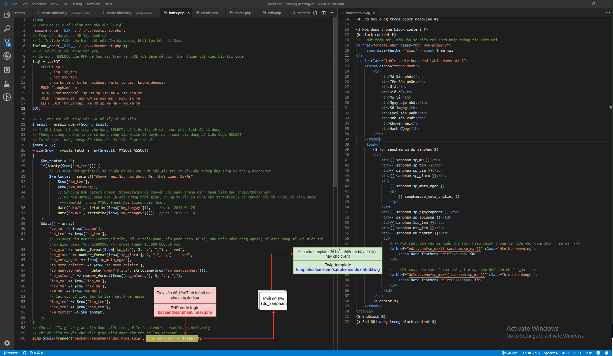

# Tạo chức năng CRUD (Thêm, Sửa, Xóa, Xem) upload hình Sản phẩm (upload đơn, mỗi lần 1 file)

- Để upload file lên Server thì chúng ta phải sử dụng form có thuộc tính `enctype="multipart/form-data"` và phương thức `POST`, thẻ input sẽ có `type="file"`.
- Khi chúng ta upload một file lên thì trên Server sẽ nhận được 5 thông số cho một file, và PHP sẽ dựa vào các thông số đó để tiến hành upload, các thông số đó là:
    - `name`: Tên của file chúng ta upload
    - `type`: Kiểu file mà chúng ta upload (hình ảnh, word, …)
    - `tmp_name`: Đường dẫn đến file tạm trên web server
    - `error`: Trạng thái của file chúng ta upload, 0 => không có lỗi
    - `size`: Kích thước của file chúng ta upload

## Lưu đồ hoạt động của quá trình Upload file từ Client lên Server
[](../../assets/php/twig/SanPhamIndex_Logic_To_Template_DataFlow.png)

## Step 1: tạo thư mục dùng để chứa các file UPLOADS
- Để tiện cho việc quản lý, ta sẽ tạo thư mục dùng để chứa các file được upload từ Clients

- Tạo thư mục `/php/twig/backend/sanpham` quản lý code logic/nghiệp vụ PHP
```
+---php
|   \---twig                    <- Đây là thư mục gốc của dự án, các bạn có thể đặt tên các bạn...
|       \---assets
|           \---uploads         <- Tạo thư mục
```

## Step 2: tạo chức năng `index` dùng để hiển thị màn hình danh sách các Hình sản phẩm có trong database
